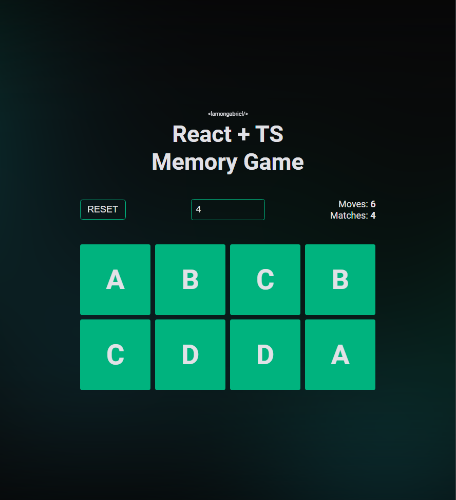

# ReactJS + TypeScript Memory Game

This project is a from professor Otávio Miranda, you can check it out [here](https://www.youtube.com/watch?v=kxfEk8okcRw).
Fun one for training react, hooks, ts typing things and overall logic.
I have create a completely new style based by my likings and added a logic to change the game size.
The styleguide is heavily inpired and comes from Rocketseat.

You can download the source code or try it [here](https://lamongabriel-ts-memory-game.netlify.app)

## Technologies used

  
  

